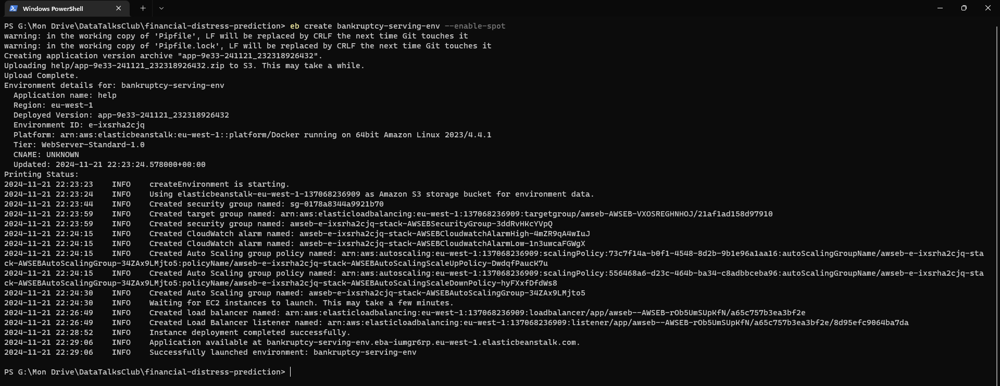
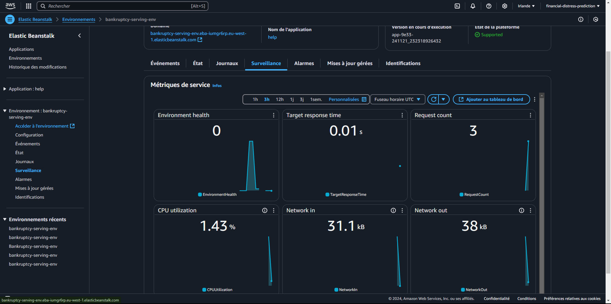
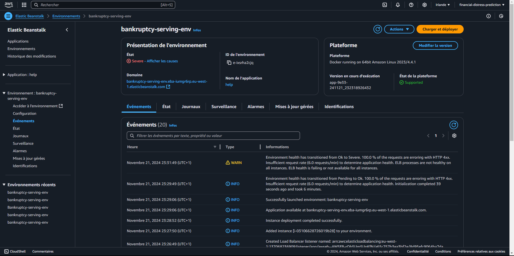

# Financial Distress Prediction Project


## Problem description

This project focuses on predicting financial distress for companies using machine learning models and deploying the solution as a web service.

## Data Processing

- Exploratory Data Analysis (**EDA**)
- Feature importance analysis
- Data preprocessing pipeline with one-hot encoding

The dataset includes:
- **Features**: x1, x2, ..., x83 (detailed financial ratios, revenues, liabilities, and other indicators).
- **Target**: Initially a numerical value representing financial health. It has been transformed into a binary label indicating whether a company is in financial distress, using a threshold of -0.5.

## Model Training

- Logistic Regression
- Decision Trees
- Ensemble Models (Random Forest, XGBoost)

## Deployment

The model is deployed using Flask, providing a REST API to make predictions from input data.

### Testing the Service:
1. Clone this repository:
   ```bash
   git clone https://github.com/Bruce2Cluny191/financial-distress-prediction.git
   cd financial-distress-prediction
   ```
2. Install dependencies (see below).
3. Run the Flask service:
   ```bash
   python predict.py
   ```
4. Send a POST request to the `/predict` endpoint with a JSON payload containing company features. Example:
   ```bash
   python predict-test.py
   ```

## Dependencies and Environment Setup

- Use `pipenv` to manage the environment:
  ```bash
  pipenv install
  pipenv shell
  ```

- Key files:
  - `Pipfile`: Dependency list.
  - `Dockerfile`: For containerization.

## Containerization

A Docker image has been built to simplify deployment. Steps to build and run:
```bash
docker build -t bankruptcy .
docker run -it --rm -p 9696:9696 bankruptcy
```

## Cloud Deployment

The service has been deployed on AWS Elastic Beanstalk and tested with an adapted script:
   ```bash
   python predict-test-aws-cloud.py
   ```

1. 

2. 

3. 

4. 

## Reproducibility

To reproduce this project:
1. Download the dataset from [Kaggle](https://www.kaggle.com/datasets/shebrahimi/financial-distress) or directly from repository.
2. Run the `notebook.ipynb` notebook for data exploration.
3. Train the model using:
   ```bash
   python train.py
   ```
4. Follow the deployment instructions.